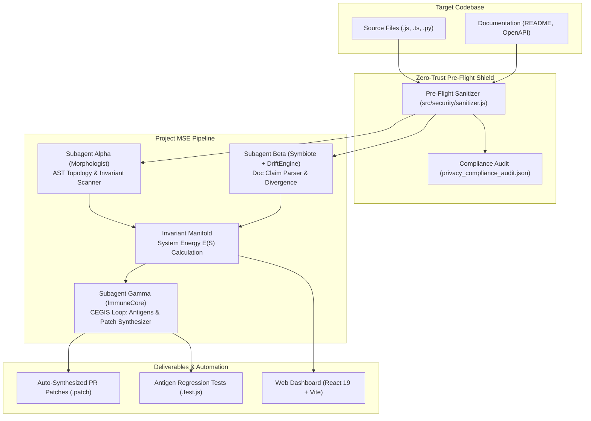

# Morphogenetic Software Engine (Project MSE) 

[-success?style=for-the-badge&logo=vitest)](./test)
[](./docs/SESSION_SUMMARY.md)
[](./src/security/sanitizer.js)
[](https://vercel.com/new)
[](./LICENSE)

> **A Bio-Inspired Autonomous Engine for Self-Healing AST Topologies, Invariant Manifolds, Documentation Reconciliation, and Inductive Synthesis.**

The **Morphogenetic Software Engine (Project MSE)** treats software systems as dynamic biological organisms. Rather than relying on fragile manual maintenance or shallow linters, MSE preserves system homeostasis by continuously mapping code AST topologies, measuring documentation divergence, calculating system thermodynamic energy $E(S)$, and synthesizing verified, minimal repair patches through counterexample-guided inductive synthesis (CEGIS).

---

##  Table of Contents

- [Key Architecture & Subagents](#-key-architecture--subagents)
  - [Subagent Alpha: The Morphologist](#1-subagent-alpha-the-morphologist-ast-topology)
  - [Subagent Beta: The Symbiote & Drift Engine](#2-subagent-beta-the-symbiote--drift-engine)
  - [Subagent Gamma: The Immune Core & CEGIS](#3-subagent-gamma-the-immune-core--patch-synthesizer)
  - [The Invariant Manifold & Energy Equation](#4-the-invariant-manifold--system-energy-es)
  - [Enterprise Data Privacy & Anti-Leakage Shield](#5-enterprise-data-privacy--anti-leakage-shield)
- [Architecture Flow Diagram](#-architecture-flow-diagram)
- [Web Dashboard UI (`project-mse`)](#-web-dashboard-ui-project-mse)
- [Deploying to Vercel](#-deploying-to-vercel)
- [Local Quickstart](#-local-quickstart)
- [Verification Test Suite](#-verification-test-suite)
- [Repository Structure](#-repository-structure)
- [License](#-license)

---

##  Key Architecture & Subagents

### 1. Subagent Alpha: The Morphologist (AST Topology)
- **Static Invariant Extraction**: Scans multi-file source trees (JavaScript, TypeScript, Python) using safe AST visitors.
- **Topology Mapping**: Identifies route manifests, async boundaries, unhandled state mutations, database transaction scopes, and critical concurrency locks.
- **Telemetry**: Emits `discovered_invariants.json` with severity rankings (`CRITICAL`, `HIGH`, `MEDIUM`, `LOW`).

### 2. Subagent Beta: The Symbiote & Drift Engine
- **Declarative Claim Extraction**: Ingests prose documentation (`README.md`, setup guides, architecture decision records) and structured API specifications (`openapi.yaml`).
- **Drift Reconciliation**: Compares documented claims against AST reality to detect 8 categories of drift:
  - `PORT_MISMATCH` (e.g., documented port 3000 vs. bound port 8080)
  - `ENV_VAR_UNDECLARED` (environment variable read by code but absent from docs)
  - `ENV_VAR_PHANTOM` (documented environment variable never accessed in code)
  - `ROUTE_UNDOCUMENTED` & `ROUTE_PHANTOM`
  - `AUTH_SCHEME_MISMATCH` (e.g., README claims HMAC-SHA256; code lacks signature verification)
  - `HEADER_UNDOCUMENTED` & `SYMBOL_UNDOCUMENTED`
- **Divergence Metric**: Computes the intent divergence score $D_{\text{intent}} \in [0, 1]$.

### 3. Subagent Gamma: The Immune Core & Patch Synthesizer
- **Antigen Counterexample Synthesis**: For every detected invariant violation or critical drift, synthesizes an executable test with:
  - **RED Assertion**: Fails against the current vulnerable implementation.
  - **GREEN Baseline Assertion**: Passes under normal operating invariants.
- **Atomic Patch Generation**: Executes a 4-tier synthesis strategy producing clean unified diffs (`.patch`):
  - `AUTH_GUARD_INSERTION`: HMAC-SHA256 signature verification & Bearer token guards.
  - `MUTEX_WRAPPING`: Concurrency safety wrapping.
  - `TRANSACTION_ROLLBACK`: Database transaction lifecycle wrapping (`BEGIN` / `COMMIT` / `ROLLBACK`).
  - `ASYNC_IO_CONVERSION`: Non-blocking event loop conversions.
- **Pull Request Automation**: Formats automated GitHub PR descriptions with test evidence, blast radius analysis, and postcondition contracts.

### 4. The Invariant Manifold & System Energy $E(S)$
The system calculates the overall architectural thermodynamic energy $E(S)$:

$$E(S) = D_{\text{intent}} + \lambda R_{\text{inv}} + \gamma L_{\text{ast}}$$

- $D_{\text{intent}}$: Intentional divergence between documentation and code.
- $R_{\text{inv}}$: Weighted penalty for unresolved invariant violations.
- $L_{\text{ast}}$: AST complexity and uncontained async mutation penalty.
- **Homeostasis**: Applying synthesized patches minimizes energy ($\Delta E(S) < 0$), driving the codebase back toward stability.

### 5. Enterprise Data Privacy & Anti-Leakage Shield
A production-grade, zero-trust sanitization and in-memory execution layer enforcing IBM Cloud credential safety:
- **Pass 1  -  Hard Exclusion**: Neutralizes `.env`, `.env.*`, `credentials.json`, `service-account.json`, `*.pem`, `*.key` with static safe stubs.
- **Pass 2  -  Regex Masking**: Neutralizes cloud keys (AWS AKIA, GCP service accounts, Azure connection strings), cryptographic keys (RSA/PEM blocks), tokens (JWT, Stripe, GitHub), and Database DSNs (PostgreSQL, MongoDB, Redis, MySQL) while **preserving schema topology** for AST parsing.
- **Pass 3  -  Shannon Entropy Scanner**: Automatically redacts high-entropy quoted literals ($\ge 4.0\text{ bits/char}$, length $\ge 20$) with sentinel double-redaction guards.
- **Ephemeral In-Memory Execution**: Raw file buffers are purged (`purgeRawBuffer`) after ingestion.
- **Compliance Audit Attestation**: Automatically compiles `privacy_compliance_audit.json` with per-category counters, token hashes only, and a verifiable SHA-256 integrity checksum.

---

##  Architecture Flow Diagram



---

##  Web Dashboard UI (`project-mse`)

The repository includes a modern, high-performance web dashboard built with **React 19** and **Vite 8** that provides real-time visibility into the engine:

1. **Topology View**: Repository file tree, route manifests, async boundaries, and entry point mapping.
2. **Invariants View**: Discovered invariant violations with severity badges (`CRITICAL`, `HIGH`) and file excerpts.
3. **Doc Drift View**: Real-time documentation vs. code reconciliation metrics and drift records.
4. **CEGIS View**: Counterexample test inventory and interactive unified diff patches.
5. **Pipeline Telemetry**: Live State Bus event streaming, phase status indicators (`ALPHA`, `BETA`, `GAMMA`), and live system energy score $E(S)$ meter.

---

##  Deploying to Vercel

The dashboard is pre-configured for zero-configuration, 1-click deployment on **Vercel**.

### Option A: 1-Click Deploy via Vercel Dashboard

1. Push your repository to GitHub / GitLab / Bitbucket.
2. Go to [Vercel](https://vercel.com/new).
3. Select your repository.
4. Vercel automatically detects the root `vercel.json` and builds the dashboard using:
   - **Framework Preset**: `Vite`
   - **Build Command**: `npm run build` (or `npm --prefix project-mse install && npm --prefix project-mse run build`)
   - **Output Directory**: `project-mse/dist`
5. Click **Deploy**!

### Option B: Deploying with Vercel CLI

From your terminal inside this repository root:

```bash
# Install Vercel CLI if needed
npm install -g vercel

# Deploy Preview
vercel

# Deploy to Production
vercel --prod
```

### Option C: Deploying `project-mse` Directly as Root

If you configure Vercel with Root Directory set to `project-mse`:
- The enclosed [`project-mse/vercel.json`](./project-mse/vercel.json) handles single-page app (SPA) rewrites to `/index.html` with zero extra configuration.

---

##  Local Quickstart

### Prerequisites
- **Node.js**: `>= 18.0.0` (Recommended: Node 20 or 24)
- **npm**: `>= 9.0.0`

### 1. Installation

```bash
# Clone the repository
git clone https://github.com/your-username/morphogenetic-software-engine.git
cd morphogenetic-software-engine

# Install root dependencies
npm install

# Install dashboard dependencies
npm --prefix project-mse install
```

### 2. Run the Verification Test Suite

Verify all 8 test suites and 196 tests:

```bash
npm test
```

### 3. Launch the Web Dashboard Locally

```bash
npm run dev
```

Open [http://localhost:5173](http://localhost:5173) in your browser.

### 4. Build for Production

```bash
npm run build
```

This compiles the React 19 production bundle to [`project-mse/dist/`](./project-mse/dist/).

To preview the production build locally:

```bash
npm run preview
```

### 5. Run the Core Engine on a Target Repository

```bash
# Run against a codebase
node src/core/engine.js ./test/fixtures/target_repo .mse-output
```

---

##  Verification Test Suite

The engine is backed by an exhaustive test suite covering parsers, invariant manifolds, state buses, CEGIS patch synthesis, reconcilers, enterprise sanitization, and full E2E pipelines:

```
Test Files  8 passed (8)
Tests       196 passed (196)  -  100% Pass Rate
Failures    0
Duration    ~4.8s
```

| Suite | Tests | Component Covered | Result |
|---|---|---|---|
| [`test/unit/javascript-parser.test.js`](./test/unit/javascript-parser.test.js) | 8 | AST Parsers (JS, TS, Python) | [PASS] 100% Pass |
| [`test/unit/invariant-manifold.test.js`](./test/unit/invariant-manifold.test.js) | 6 | Invariant Manifold & $E(S)$ Formula | [PASS] 100% Pass |
| [`test/unit/state-bus.test.js`](./test/unit/state-bus.test.js) | 6 | StateBus Telemetry & In-Memory Ordering | [PASS] 100% Pass |
| [`test/security/sanitizer.spec.js`](./test/security/sanitizer.spec.js) | 59 | Pre-Flight Sanitizer & Audit Verification (S1-S14) | [PASS] 100% Pass |
| [`test/invariant/morphologist-cegis.test.js`](./test/invariant/morphologist-cegis.test.js) | 7 | Alpha + Gamma CEGIS Pipeline | [PASS] 100% Pass |
| [`test/reconciler.spec.js`](./test/reconciler.spec.js) | 43 | Beta Reconciler (Symbiote + Drift Engine) | [PASS] 100% Pass |
| [`test/integration/phase5-e2e.test.js`](./test/integration/phase5-e2e.test.js) | 37 | Phase 5 Full E2E Pipeline on `target_repo` | [PASS] 100% Pass |
| [`test/immune.spec.js`](./test/immune.spec.js) | 30 | Immune Core, Patch Synthesizer & PR Formatter | [PASS] 100% Pass |
| **Total** | **196** | **Complete Engine & Security Shield** | **[PASS] 100%** |

---

##  Repository Structure

```
.
├── vercel.json                         # Vercel root deployment configuration
├── package.json                        # Root workspace scripts (build, dev, test)
├── vitest.config.js                    # Vitest runner configuration
├── docs/
│   └── SESSION_SUMMARY.md              # IBM Bob 2.0 Task Session Summary & Audit
├── project-mse/                        # Web Dashboard UI (React 19 + Vite 8)
│   ├── vercel.json                     # Subdirectory Vercel deployment config
│   ├── package.json                    # Dashboard dependencies & scripts
│   ├── vite.config.js                  # Vite bundler configuration
│   ├── index.html                      # HTML5 entry with Google Fonts & SEO
│   └── src/
│       ├── App.jsx                     # Dashboard tabs (Topology, Invariants, Drift, CEGIS, Pipeline)
│       ├── App.css                     # Premium dark-mode UI stylesheet
│       └── main.jsx                    # React 19 root mount
├── src/
│   ├── agents/
│   │   ├── morphologist.js             # Subagent Alpha: AST crawler & invariant extraction
│   │   ├── symbiote.js                 # Subagent Beta: Documentation claim extractor
│   │   └── immuneCore.js               # Subagent Gamma: CEGIS test synthesis & repair
│   ├── cegis/
│   │   └── patchSynthesizer.js         # Unified diff patch generation heuristics
│   ├── core/
│   │   ├── engine.js                   # Top-level MSE pipeline orchestrator
│   │   ├── invariant-manifold.js       # System energy E(S) calculation
│   │   ├── prFormatter.js              # PR description & antigen formatter
│   │   └── state-bus.js                # Telemetry event bus
│   ├── reconciler/
│   │   └── driftEngine.js              # Drift detection and D_intent scoring
│   └── security/
│       ├── sanitizer.js                # Pre-flight secret redaction & entropy engine
│       ├── auditReport.js              # Compliance verification & SHA-256 integrity logger
│       └── pathguard.js                # Path traversal and sandbox directory protection
└── test/
    ├── fixtures/
    │   └── target_repo/                # Realistic microservice fixture with intentional defects
    ├── integration/
    │   └── phase5-e2e.test.js          # Full end-to-end integration suite (37 tests)
    └── security/
        └── sanitizer.spec.js           # 59-test zero-leakage compliance suite
```

---

##  License

This project is licensed under the [MIT License](./LICENSE).
