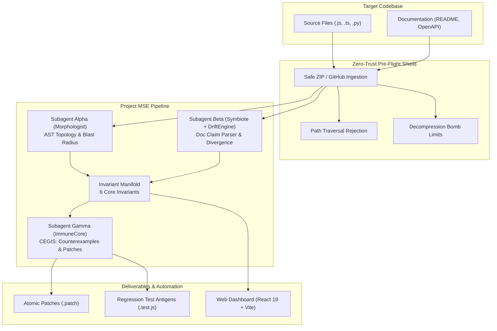

# Morphogenetic Software Engine (Project MSE)

[-success?style=for-the-badge&logo=vitest)](./test)
[](./docs/SUBMISSION_CHECKLIST.md)
[](./project-mse)
[](https://vercel.com/new)
[](./LICENSE)

> **Understand. Detect. Explain. Challenge. Repair. Verify.**
>
> A biological software engine that preserves system homeostasis by continuously mapping code AST topologies, measuring specification drift, synthesizing executable counterexamples, generating atomic repair patches, and verifying fixes against in-memory contracts.

---

## The Core Problem

Modern software development is plagued by **semantic divergence**:
- Documentation states endpoints require HMAC authentication; code processes payloads unguarded.
- Configuration guides state services listen on port 3000; runtime code defaults to 8080.
- Database transactions open with `BEGIN` but omit error-path `ROLLBACK` handling, leading to silent lock escalation and data corruption.
- Conventional AI assistants generate code without verification, adding more unverified surface area.

**MSE is not another chatbot.** It acts as an autonomous biological immune system for codebases:
1. **Understands**: Safely parses repository topologies into in-memory AST graphs.
2. **Detects**: Reconciles documentation and configuration against source code reality.
3. **Explains**: Provides deterministic, evidence-based rationales without hallucination.
4. **Challenges**: Synthesizes executable counterexample unit tests proving invariant violations.
5. **Repairs**: Generates minimal, atomic unified diff patches.
6. **Verifies**: Re-audits the mutated AST in volatile RAM to confirm that violations are resolved without introducing regressions.

---

## Key Architecture & Subagents

### 1. Subagent Alpha: The Morphologist (AST Topology & Blast Radius)
- **Static Invariant Extraction**: Scans multi-file source trees (JavaScript, TypeScript) using safe lexical visitors.
- **Topology & Call-Graph Mapping**: Indexes route manifests, async boundaries, unhandled state mutations, and database transactions.
- **Deterministic Blast Radius**: Traces upstream callers, downstream dependencies, and affected test suites across the dependency graph.

### 2. Subagent Beta: The Symbiote & Drift Engine
- **Declarative Claim Extraction**: Ingests prose documentation (`README.md`, setup guides) and configuration templates (`.env.example`).
- **Drift Reconciliation**: Compares documented claims against AST reality to detect port mismatches, undeclared environment variables, and authentication scheme divergence.
- **Deterministic Why**: Generates human-readable explanations directly from empirical evidence citations.

### 3. Subagent Gamma: The Immune Core & CEGIS
- **Antigen Counterexample Synthesis**: For every invariant violation, synthesizes a structured attack scenario with an executable Vitest/Jest regression test artifact.
- **Atomic Patch Generation**: Executes multi-tier repair strategies producing clean unified diffs (`.patch`) for auth guard insertion, webhook signature verification, and documentation reconciliation.

### 4. The Invariant Manifold & Verification Gate
- Evaluates 6 core architectural invariants (`INV-001` through `INV-006`).
- Enforces the **MSE Verification Gate** decision model (`VERIFIED`, `REJECTED`, `NEEDS REVIEW`):
  - ✓ Original counterexample resolved and no longer reproduces
  - ✓ Synthesized regression test passes
  - ✓ Supported system invariant restored
  - ✓ AST syntax & build check passes
  - ✓ No newly detected supported violation introduced

### 5. Repository Ingestion & In-Memory Operation
- **Canonical Enterprise Fixture**: Built-in `enterprise-payment-core` fixture with realistic specification drift and webhook security vulnerabilities.
- **ZIP Upload**: In-memory archive extraction protected by Zip Slip path traversal rejection, compression bomb ceilings, and binary dropping.
- **Public GitHub Ingestion**: Direct repository tree and source ingestion via GitHub's public REST APIs.
- **Zero Host File Mutation**: All analyses, patch applications, and verifications occur exclusively in volatile RAM.

---

## Architecture Flow Diagram



---

## Web Dashboard UI (`project-mse`)

The repository includes a modern, high-performance web dashboard built with **React 19** and **Vite 8** that provides real-time visibility into the engine:

1. **Landing Page** — Three ingestion options: Built-in Enterprise Fixture, ZIP Upload, GitHub URL
2. **Overview** — Executive dashboard with repository scale, findings breakdown, verification gate status
3. **Findings** — Unified findings list with search/filter, severity badges, evidence indicators
4. **Finding Detail** — Trust & Explainability Matrix (What/Why/Where/What Could Break/What MSE Changed/How Verified), Evidence Chain, Blast Radius, Gamma Counterexample, Candidate Patch, Verification Gate
5. **Changes** — Unified diff viewer with patch application controls, verification gate checklist
6. **Verification** — Clean VERIFIED/REJECTED state with 5 acceptance checks, metrics display
7. **Runs** — Historical session memory with one-click restore
8. **Report** — Presentation-ready Markdown/JSON export with executive summary, findings, invariants, patches, verification checks, limitations
9. **Code Explorer** — Source code viewer with line highlighting, tabbed interface
10. **Technical Drawer** — Progressive disclosure of Alpha/Beta/Gamma internals, live telemetry console

---

## Deploying to Vercel

The dashboard is pre-configured for zero-configuration, 1-click deployment on **Vercel**.

### Option A: 1-Click Deploy via Vercel Dashboard

1. Push your repository to GitHub / GitLab / Bitbucket.
2. Go to [Vercel](https://vercel.com/new).
3. Select your repository.
4. Vercel automatically detects the root `vercel.json` and builds the dashboard using:
   - **Framework Preset**: `Vite`
   - **Build Command**: `npm run build` (or `npm --prefix project-mse install && npm --prefix project-mse run build`)
   - **Output Directory**: `project-mse/dist`
5. Click **Deploy**!

### Option B: Deploying with Vercel CLI

From your terminal inside this repository root:

```bash
# Install Vercel CLI if needed
npm install -g vercel

# Deploy Preview
vercel

# Deploy to Production
vercel --prod
```

### Option C: Deploying `project-mse` Directly as Root

If you configure Vercel with Root Directory set to `project-mse`:
- The enclosed [`project-mse/vercel.json`](./project-mse/vercel.json) handles single-page app (SPA) rewrites to `/index.html` with zero extra configuration.

---

## Local Quickstart

### Prerequisites
- **Node.js**: `>= 18.0.0` (Recommended: Node 20 or 24)
- **npm**: `>= 9.0.0`

### 1. Installation

```bash
# Clone the repository
git clone https://github.com/your-username/morphogenetic-software-engine.git
cd morphogenetic-software-engine

# Install root dependencies
npm install

# Install dashboard dependencies
npm --prefix project-mse install
```

### 2. Run the Verification Test Suite

Verify all 8 test suites and 196 tests (root) + 135 tests (project-mse):

```bash
npm test
```

### 3. Launch the Web Dashboard Locally

```bash
npm run dev
```

Open [http://localhost:5173](http://localhost:5173) in your browser.

### 4. Build for Production

```bash
npm run build
```

This compiles the React 19 production bundle to [`project-mse/dist/`](./project-mse/dist/).

To preview the production build locally:

```bash
npm run preview
```

---

## Verification Test Suite

The engine is backed by an exhaustive test suite covering parsers, invariant manifolds, state buses, CEGIS patch synthesis, reconcilers, enterprise sanitization, and full E2E pipelines:

```
Test Files  8 passed (8)
Tests       196 passed (196)  -  100% Pass Rate
Failures    0
Duration    ~2.7s
```

| Suite | Tests | Component Covered | Result |
|---|---|---|---|
| [`test/unit/javascript-parser.test.js`](./test/unit/javascript-parser.test.js) | 8 | AST Parsers (JS, TS, Python) | [PASS] 100% Pass |
| [`test/unit/invariant-manifold.test.js`](./test/unit/invariant-manifold.test.js) | 6 | Invariant Manifold & System Energy | [PASS] 100% Pass |
| [`test/unit/state-bus.test.js`](./test/unit/state-bus.test.js) | 6 | StateBus Telemetry & In-Memory Ordering | [PASS] 100% Pass |
| [`test/security/sanitizer.spec.js`](./test/security/sanitizer.spec.js) | 59 | Pre-Flight Sanitizer & Audit Verification | [PASS] 100% Pass |
| [`test/invariant/morphologist-cegis.test.js`](./test/invariant/morphologist-cegis.test.js) | 7 | Alpha + Gamma CEGIS Pipeline | [PASS] 100% Pass |
| [`test/reconciler.spec.js`](./test/reconciler.spec.js) | 43 | Beta Reconciler (Symbiote + Drift Engine) | [PASS] 100% Pass |
| [`test/integration/phase5-e2e.test.js`](./test/integration/phase5-e2e.test.js) | 37 | Phase 5 Full E2E Pipeline | [PASS] 100% Pass |
| [`test/immune.spec.js`](./test/immune.spec.js) | 30 | Immune Core, Patch Synthesizer & PR Formatter | [PASS] 100% Pass |
| **Total (Root)** | **196** | **Complete Engine & Security Shield** | **[PASS] 100%** |

| Suite | Tests | Component Covered | Result |
|---|---|---|---|
| [`project-mse/test/engine.test.js`](./project-mse/test/engine.test.js) | 28 | Pipeline Orchestration | [PASS] 100% Pass |
| [`project-mse/test/enterprise-fixture.test.js`](./project-mse/test/enterprise-fixture.test.js) | 20 | Canonical Demo Fixture | [PASS] 100% Pass |
| [`project-mse/test/product-flow.test.js`](./project-mse/test/product-flow.test.js) | 3 | End-to-End Product Flow | [PASS] 100% Pass |
| [`project-mse/test/phase2-mechanisms.test.js`](./project-mse/test/phase2-mechanisms.test.js) | 34 | Alpha/Beta/Gamma Mechanisms | [PASS] 100% Pass |
| [`project-mse/test/failure-handling.test.js`](./project-mse/test/failure-handling.test.js) | 21 | Error Handling & Partial Analysis | [PASS] 100% Pass |
| [`project-mse/test/security-hardening.test.js`](./project-mse/test/security-hardening.test.js) | 29 | Zip Slip, Binary Drop, URL Sanitization | [PASS] 100% Pass |
| **Total (project-mse)** | **135** | **Dashboard & Engine Integration** | **[PASS] 100%** |

---

## Repository Structure

```
.
├── vercel.json                         # Vercel root deployment configuration
├── package.json                        # Root workspace scripts (build, dev, test)
├── vitest.config.js                    # Vitest runner configuration
├── docs/
│   ├── ARCHITECTURE.md                 # System architecture specification
│   ├── DEMO_RUN.md                     # Canonical demonstration run record
│   ├── CLAIMS.md                       # Honest capabilities & scope disclosure
│   ├── SUBMISSION_CHECKLIST.md         # Hackathon submission evidence package
│   └── DEMO_SCRIPT.md                  # 90-120 second judge demonstration script
├── project-mse/                        # Web Dashboard UI (React 19 + Vite 8)
│   ├── vercel.json                     # Subdirectory Vercel deployment config
│   ├── package.json                    # Dashboard dependencies & scripts
│   ├── vite.config.js                  # Vite bundler configuration
│   ├── index.html                      # HTML5 entry with Google Fonts & SEO
│   ├── public/
│   │   ├── favicon.svg
│   │   └── icons.svg
│   ├── src/
│   │   ├── main.jsx                    # React 19 root mount
│   │   ├── App.jsx                     # Main application shell & state
│   │   ├── App.css                     # Premium dark-mode UI stylesheet
│   │   ├── index.css                   # Tailwind CSS imports
│   │   ├── components/
│   │   │   ├── HeaderBar.jsx           # Top navigation bar
│   │   │   ├── Sidebar.jsx             # Left navigation sidebar
│   │   │   ├── CenterWorkspace.jsx     # Center workspace router
│   │   │   ├── LandingPage.jsx         # Repository ingestion landing
│   │   │   ├── FileTree.jsx            # File explorer
│   │   │   ├── CodeEditor.jsx          # Source code viewer
│   │   │   ├── ErrorBoundary.jsx       # React error boundary
│   │   │   ├── VerificationConsole.jsx # Telemetry & console
│   │   │   ├── TechnicalDrawer.jsx     # Progressive disclosure drawer
│   │   │   ├── workspace/
│   │   │   │   ├── OverviewView.jsx    # Executive dashboard
│   │   │   │   ├── FindingsView.jsx    # Findings list
│   │   │   │   ├── FindingDetailView.jsx # Finding detail with evidence chain
│   │   │   │   ├── ChangeReviewView.jsx  # Unified diff & patch application
│   │   │   │   ├── VerificationView.jsx  # Verification gate visualization
│   │   │   │   ├── ReportView.jsx      # Report export view
│   │   │   │   ├── SourceView.jsx      # Code explorer
│   │   │   │   ├── RunsView.jsx        # Analysis session history
│   │   │   │   ├── CounterexampleView.jsx # Gamma counterexample view
│   │   │   │   ├── EvidenceChainView.jsx  # Evidence chain navigator
│   │   │   │   ├── BlastRadiusView.jsx   # Impact/blast radius visualization
│   │   │   │   ├── DriftView.jsx         # Specification drift view
│   │   │   │   └── InvariantInspector.jsx # Invariant detail inspector
│   │   ├── engine/
│   │   │   ├── index.js                # Engine public API
│   │   │   ├── pipeline.js             # Pipeline orchestrator (sync + async)
│   │   │   ├── types.js                # TypeScript-like type definitions
│   │   │   ├── pathUtils.js            # Path normalization & safety
│   │   │   ├── ingest/
│   │   │   │   ├── index.js            # Ingestion exports
│   │   │   │   ├── zipLoader.js        # Safe ZIP extraction
│   │   │   │   ├── githubLoader.js     # GitHub REST API ingestion
│   │   │   │   ├── enterpriseRepository.js # Canonical enterprise fixture
│   │   │   │   └── demoRepository.js   # Lightweight demo fixture
│   │   │   ├── repositoryGraph/
│   │   │   │   ├── index.js            # Alpha: AST analysis
│   │   │   │   └── blastRadius.js      # Blast radius calculation
│   │   │   ├── drift/
│   │   │   │   └── index.js            # Beta: Spec drift reconciliation
│   │   │   ├── invariants/
│   │   │   │   └── index.js            # Invariant manifold evaluation
│   │   │   ├── counterexample/
│   │   │   │   └── index.js            # Gamma: CEGIS counterexample synthesis
│   │   │   ├── patch/
│   │   │   │   └── index.js            # Atomic patch synthesis
│   │   │   ├── verify/
│   │   │   │   └── index.js            # Verification kernel & gate
│   │   │   └── report/
│   │   │       └── index.js            # Report generation (JSON + Markdown)
│   │   ├── utils/
│   │   │   ├── sessionManager.js       # Browser localStorage run history
│   │   │   ├── securityUtils.js        # Path traversal, binary detection, HTML escaping
│   │   │   ├── findingsAdapter.js      # Unified findings + evidence chain builder
│   │   │   ├── downloadUtils.js        # Safe file download helpers
│   │   │   └── diffUtils.js            # Unified diff parser
│   │   └── data/
│   │       └── mockFiles.js            # Legacy mock data
│   ├── test/
│   │   ├── engine.test.js              # Pipeline integration tests
│   │   ├── enterprise-fixture.test.js  # Canonical fixture verification
│   │   ├── product-flow.test.js        # End-to-end product flow tests
│   │   ├── phase2-mechanisms.test.js   # Alpha/Beta/Gamma mechanism tests
│   │   ├── failure-handling.test.js    # Error state handling tests
│   │   └── security-hardening.test.js  # Security hardening tests
│   └── dist/                           # Production build output
├── src/
│   ├── agents/
│   │   ├── morphologist.js             # Subagent Alpha: AST crawler & invariant extraction
│   │   ├── symbiote.js                 # Subagent Beta: Documentation claim extractor
│   │   └── immuneCore.js               # Subagent Gamma: CEGIS test synthesis & repair
│   ├── cegis/
│   │   └── patchSynthesizer.js         # Unified diff patch generation heuristics
│   ├── core/
│   │   ├── engine.js                   # Top-level MSE pipeline orchestrator
│   │   ├── invariant-manifold.js       # System energy E(S) calculation
│   │   ├── prFormatter.js              # PR description & antigen formatter
│   │   └── state-bus.js                # Telemetry event bus
│   ├── reconciler/
│   │   └── driftEngine.js              # Drift detection and D_intent scoring
│   └── security/
│       ├── sanitizer.js                # Pre-flight secret redaction & entropy engine
│       ├── auditReport.js              # Compliance verification & SHA-256 integrity logger
│       └── pathguard.js                # Path traversal and sandbox directory protection
├── cegis-antigens/                     # Generated CEGIS regression test antigens
├── test/
│   ├── fixtures/
│   │   └── target_repo/                # Realistic microservice fixture with intentional defects
│   ├── integration/
│   │   └── phase5-e2e.test.js          # Full end-to-end integration suite
│   └── security/
│       └── sanitizer.spec.js           # 59-test zero-leakage compliance suite
└── discovered_invariants.json          # Invariants discovered during analysis
```

---

## License

This project is licensed under the [MIT License](./LICENSE).